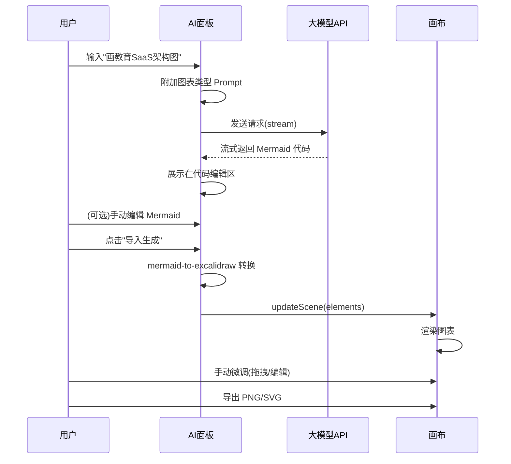

# ExcaliDraw AI — 产品需求文档 (PRD)

> **项目名称**: ExcaliDraw AI  
> **版本**: v1.0.0  
> **许可证**: MIT（需保留 Excalidraw 原始 LICENSE）  
> **作者**: [你的名字/GitHub ID]  
> **日期**: 2026-05-05  

---

## 一、产品定位

一款 macOS 桌面端 AI 智能绘图工具。左侧为可折叠的 AI 助手面板，右侧为完整的 Excalidraw 画布。用户通过自然语言描述需求，AI 大模型解析后生成结构化数据，一键导入画布生成专业图表。同时保留 Excalidraw 全部原生手绘能力，AI 只是辅助工具。

---

## 二、技术选型（铁律约束）

| 层级 | 技术 | 原因 |
|------|------|------|
| **桌面框架** | **Tauri 2.x**（非 Electron） | 包体小(<15MB)、性能好、macOS 原生 WebView |
| **前端框架** | React 18 + TypeScript | Excalidraw NPM 包是 React 组件 |
| **构建工具** | Vite 5 | 快速 HMR，Tauri 官方推荐 |
| **画布引擎** | `@excalidraw/excalidraw` (MIT) | 官方 NPM 包，免费 |
| **Mermaid 转换** | `@excalidraw/mermaid-to-excalidraw` (MIT) | 官方免费包 |
| **UI 风格** | Apple Liquid Glass（macOS 26） | 玻璃液态毛玻璃效果 |
| **大模型调用** | OpenAI 兼容格式 HTTP API | 兼容 DeepSeek/通义千问/GLM-4/OpenAI |
| **状态管理** | Zustand | 轻量 |
| **本地存储** | Tauri fs API + JSON 文件 | 设置持久化 |

> [!CAUTION]
> **禁止使用 Electron**，包体过大。禁止使用任何付费组件。所有依赖必须 MIT/Apache-2.0 协议。

---

## 三、功能模块

### 3.1 整体布局

```
┌─────────────────────────────────────────────────────┐
│  标题栏（Tauri 原生 + 拖拽区）          [⚙️ 设置]  │
├──────────────┬──────────────────────────────────────┤
│              │                                      │
│  AI 助手面板  │        Excalidraw 画布               │
│  (可折叠)    │        (完整原生功能)                  │
│   320px      │         剩余空间                      │
│              │                                      │
│  ┌────────┐  │                                      │
│  │图表类型 │  │                                      │
│  │下拉菜单 │  │                                      │
│  └────────┘  │                                      │
│              │                                      │
│  ┌────────┐  │                                      │
│  │对话区域 │  │                                      │
│  │        │  │                                      │
│  └────────┘  │                                      │
│              │                                      │
│  ┌────────┐  │                                      │
│  │JSON    │  │                                      │
│  │预览/   │  │                                      │
│  │编辑区  │  │                                      │
│  └────────┘  │                                      │
│              │                                      │
│ [📥 导入生成]│                                      │
│              │                                      │
├──────────────┴──────────────────────────────────────┤
│  状态栏（当前模型 / 连接状态 / 画布元素数量）         │
└─────────────────────────────────────────────────────┘
```

### 3.2 AI 助手面板（左侧）

#### 3.2.1 折叠/展开
- 点击侧边按钮或快捷键 `Cmd+B` 折叠/展开
- 折叠后只显示一个展开图标，画布占满全屏
- 展开宽度固定 320px，可拖拽调整（240-480px）

#### 3.2.2 图表类型选择器（下拉菜单）
提供以下预设类型，影响 System Prompt：

| 类型 | 对应 Prompt 模板 |
|------|----------------|
| 🏗️ 架构图 | 系统架构、技术选型、模块划分 |
| 📊 流程图 | 业务流程、审批流程、操作步骤 |
| 🗺️ 思维导图 | 头脑风暴、知识梳理 |
| 🔄 时序图 | API 调用、系统交互 |
| 📋 ER 图 | 数据库设计、实体关系 |
| 🎯 用例图 | 功能分析、需求拆解 |
| 📝 自由绘制 | 不限定类型，AI 自行判断 |

#### 3.2.3 对话区域
- 支持多轮对话，保持上下文
- 用户输入自然语言（如"画一个教育 SaaS 产品的架构图"）
- AI 返回文字解释 + 结构化数据
- 对话气泡样式，区分用户/AI
- 支持清空对话

#### 3.2.4 数据预览/编辑区
- AI 生成的 Mermaid 代码或 JSON 数据在此展示
- **可手动编辑**（代码编辑器，带语法高亮）
- 实时校验格式正确性
- 编辑后可重新预览

#### 3.2.5 导入生成按钮
- 点击后将数据转换为 Excalidraw 元素
- 自动导入右侧画布并居中显示
- 支持追加模式（不清空现有画布内容）和替换模式

### 3.3 Excalidraw 画布（右侧）

- 嵌入 `@excalidraw/excalidraw` React 组件
- **保留 100% 原生功能**：手绘、形状、文字、箭头、橡皮擦、缩放、暗色模式、导出等
- 不做任何功能裁剪或隐藏
- 画布状态自动保存到本地（防崩溃丢失）

### 3.4 设置面板（弹窗 Modal）

点击右上角 ⚙️ 齿轮图标打开：

#### 3.4.1 模型配置

```
┌─ 模型配置 ─────────────────────────────┐
│                                         │
│  API 服务商:  [下拉选择 ▾]              │
│    ├ DeepSeek                           │
│    ├ 通义千问 (Qwen)                    │
│    ├ 智谱 GLM                           │
│    ├ OpenAI                             │
│    ├ 月之暗面 (Kimi)                    │
│    └ 自定义...                          │
│                                         │
│  API Key:  [••••••••••••••] 👁️          │
│                                         │
│  API Base URL:  [自动填充，可修改]       │
│                                         │
│  模型名称:  [输入框，可手动输入 ▾]       │
│    推荐: deepseek-chat / qwen-max       │
│                                         │
│  [🔍 测试连接]                          │
│                                         │
└─────────────────────────────────────────┘
```

**逻辑**：
- 选择服务商后自动填充 Base URL
- 用户只需填 API Key
- 模型名称为可输入的下拉框（combo box），可手动输入任意模型名
- 测试连接按钮发送一个简单请求验证配置

预设服务商配置表：

| 服务商 | Base URL | 默认模型 |
|--------|----------|---------|
| DeepSeek | `https://api.deepseek.com/v1` | `deepseek-chat` |
| 通义千问 | `https://dashscope.aliyuncs.com/compatible-mode/v1` | `qwen-max` |
| 智谱 GLM | `https://open.bigmodel.cn/api/paas/v4` | `glm-4` |
| OpenAI | `https://api.openai.com/v1` | `gpt-4o` |
| 月之暗面 | `https://api.moonshot.cn/v1` | `moonshot-v1-8k` |
| 自定义 | 用户填写 | 用户填写 |

#### 3.4.2 关于/开源信息

```
┌─ 关于 ──────────────────────────────────┐
│                                         │
│  ExcaliDraw AI v1.0.0                   │
│  MIT License                            │
│                                         │
│  作者: [你的名字]                        │
│  GitHub: github.com/xxx/excalidraw-ai   │
│  Gitee:  gitee.com/xxx/excalidraw-ai    │
│                                         │
│  本项目使用了以下开源组件:               │
│  • Excalidraw (MIT) - excalidraw.com    │
│  • Tauri (MIT/Apache-2.0)               │
│  • React (MIT)                          │
│                                         │
│  ⭐ 如果觉得有用，请给个 Star！          │
│                                         │
└─────────────────────────────────────────┘
```

---

## 四、UI/UX 设计规范

### 4.1 Liquid Glass 风格（Apple macOS 26）

```css
/* === 核心设计 Token === */

/* 玻璃面板 */
--glass-bg: rgba(255, 255, 255, 0.12);
--glass-bg-hover: rgba(255, 255, 255, 0.18);
--glass-border: 1px solid rgba(255, 255, 255, 0.15);
--glass-blur: blur(20px) saturate(180%);
--glass-shadow: 0 8px 32px rgba(0, 0, 0, 0.12);
--glass-radius: 16px;

/* 暗色主题（默认） */
--bg-primary: #0a0a0f;
--bg-secondary: #12121a;
--text-primary: rgba(255, 255, 255, 0.95);
--text-secondary: rgba(255, 255, 255, 0.6);
--accent: #007AFF;
--accent-hover: #0A84FF;

/* 动画 */
--transition-smooth: all 0.3s cubic-bezier(0.4, 0, 0.2, 1);
--transition-spring: all 0.5s cubic-bezier(0.34, 1.56, 0.64, 1);

/* 字体 */
--font-system: -apple-system, BlinkMacSystemFont, "SF Pro", "Helvetica Neue", sans-serif;
--font-mono: "SF Mono", "Fira Code", monospace;
```

### 4.2 设计原则
- **极简**：去掉一切不必要的元素，只保留功能性控件
- **毛玻璃**：左侧面板、设置弹窗、状态栏均使用 `backdrop-filter: blur()`
- **暗色优先**：默认暗色模式，与 Excalidraw 暗色模式统一
- **微动画**：面板折叠/展开、按钮悬停、数据导入时有轻微过渡动画
- **无边框窗口**：使用 Tauri 自定义标题栏，窗口四角圆角

---

## 五、AI 调用逻辑

### 5.1 Prompt 工程

所有图表生成使用统一的两步流程：

**Step 1: 大模型生成 Mermaid 代码**

```
System Prompt (以架构图为例):
你是一个专业的系统架构师。根据用户的描述，生成 Mermaid 图表代码。
规则：
1. 只输出 Mermaid 代码块，不要其他解释
2. 使用 graph TD 或 graph LR 语法
3. 节点名称使用中文
4. 合理分层，逻辑清晰
5. 使用 subgraph 对模块进行分组
```

**Step 2: 前端转换**

```javascript
import { parseMermaidToExcalidraw } from "@excalidraw/mermaid-to-excalidraw";
import { convertToExcalidrawElements } from "@excalidraw/excalidraw";
// Mermaid → Excalidraw Elements → 注入画布
```

### 5.2 API 调用格式（OpenAI 兼容）

```typescript
const response = await fetch(`${baseUrl}/chat/completions`, {
  method: "POST",
  headers: {
    "Content-Type": "application/json",
    "Authorization": `Bearer ${apiKey}`
  },
  body: JSON.stringify({
    model: modelName,
    messages: conversationHistory,
    stream: true  // 流式输出
  })
});
```

### 5.3 流式输出
- 对话区域支持 SSE 流式显示 AI 回复
- 打字机效果逐字展示

---

## 六、数据流



---

## 七、文件结构

```
excalidraw-ai/
├── src/                        # 前端源码
│   ├── App.tsx                 # 主应用入口
│   ├── components/
│   │   ├── AISidebar/          # AI 侧边栏
│   │   │   ├── AISidebar.tsx
│   │   │   ├── ChatArea.tsx    # 对话区
│   │   │   ├── CodeEditor.tsx  # 代码编辑/预览区
│   │   │   ├── DiagramTypeSelector.tsx
│   │   │   └── AISidebar.css
│   │   ├── Canvas/             # Excalidraw 画布封装
│   │   │   ├── ExcalidrawCanvas.tsx
│   │   │   └── Canvas.css
│   │   ├── Settings/           # 设置弹窗
│   │   │   ├── SettingsModal.tsx
│   │   │   ├── ModelConfig.tsx
│   │   │   ├── AboutSection.tsx
│   │   │   └── Settings.css
│   │   ├── TitleBar/           # 自定义标题栏
│   │   │   └── TitleBar.tsx
│   │   └── StatusBar/          # 状态栏
│   │       └── StatusBar.tsx
│   ├── services/
│   │   ├── llm.ts              # 大模型 API 调用
│   │   ├── mermaidConverter.ts # Mermaid 转换
│   │   └── storage.ts          # 本地存储
│   ├── stores/
│   │   └── appStore.ts         # Zustand 状态
│   ├── prompts/
│   │   └── diagramPrompts.ts   # 各图表类型 Prompt 模板
│   ├── styles/
│   │   ├── globals.css         # 全局样式 + Liquid Glass Token
│   │   └── glass.css           # 玻璃效果组件样式
│   ├── index.css
│   └── main.tsx
├── src-tauri/                  # Tauri Rust 后端
│   ├── src/main.rs
│   ├── Cargo.toml
│   └── tauri.conf.json         # Tauri 配置(窗口/权限)
├── public/
├── package.json
├── vite.config.ts
├── tsconfig.json
├── LICENSE                     # MIT + Excalidraw 归属
├── README.md
└── README_CN.md                # 中文 README
```

---

## 八、打包与分发

### 8.1 构建命令
```bash
# 开发
npm run tauri dev

# 生产构建（输出 .dmg 和 .app）
npm run tauri build
```

### 8.2 产出物
- `src-tauri/target/release/bundle/dmg/ExcaliDraw AI.dmg`
- 复制到桌面: `cp -r ... ~/Desktop/`

### 8.3 代码同步
```bash
# GitHub
git remote add github https://github.com/[你的ID]/excalidraw-ai.git
git push github main

# Gitee
git remote add gitee https://gitee.com/[你的ID]/excalidraw-ai.git
git push gitee main
```

---

## 九、Kimi 执行约束（铁律）

> [!CAUTION]
> 以下规则 Kimi 必须严格遵守，不可省略或简化

### P0 铁律
1. **必须使用 Tauri 2.x**，禁止 Electron
2. **必须使用 `@excalidraw/excalidraw` NPM 包**，不要自己造画布
3. **Excalidraw 组件不支持 SSR**，必须客户端渲染
4. **所有依赖必须免费开源**（MIT/Apache-2.0），禁止付费组件
5. **大模型调用使用 OpenAI 兼容格式**，一套代码兼容所有国内模型
6. **API Key 只存本地**（Tauri fs），不可发送到任何第三方
7. **保留 Excalidraw 原始 LICENSE 文件**，这是 MIT 协议唯一义务
8. **画布必须保留全部原生功能**，不做裁剪
9. **默认暗色模式**，与 macOS 26 Liquid Glass 风格统一
10. **窗口无边框**，自定义标题栏，四角圆角

### P1 规范
1. Mermaid 转换使用 `@excalidraw/mermaid-to-excalidraw`，不要自己写转换逻辑
2. 流式输出使用 `ReadableStream` / `EventSource`，不要等全部返回
3. 设置数据用 Tauri `fs` API 存为 JSON 文件，路径: `~/.excalidraw-ai/config.json`
4. 画布自动保存到 `~/.excalidraw-ai/autosave.excalidraw`，间隔 30 秒
5. 左侧面板折叠动画 300ms，`cubic-bezier(0.4, 0, 0.2, 1)`
6. 代码编辑区使用简单的 `<textarea>` + 语法高亮 CSS，不要引入 Monaco 等重型编辑器
7. 图表类型切换时清空对话历史，弹出确认提示
8. 导入生成按钮需要有 loading 状态和成功/失败反馈
9. 窗口最小尺寸 1024x768，默认 1440x900
10. README 中英文各一份

### 执行顺序
```
1. npx create-tauri-app（Vite + React + TypeScript）
2. 安装核心依赖
3. 实现全局样式（Liquid Glass Token）
4. 实现自定义标题栏
5. 实现 Excalidraw 画布组件
6. 实现 AI 侧边栏框架（折叠/展开）
7. 实现设置弹窗（模型配置 + 关于）
8. 实现大模型 API 调用（流式）
9. 实现 Mermaid 转换 + 导入画布
10. 实现对话功能（多轮）
11. 实现本地存储（设置 + 自动保存）
12. 调试、打包 .dmg
13. 复制到桌面
14. 初始化 Git，推送 GitHub + Gitee
```

---

## 十、验收标准

- [ ] Tauri 打包的 .app 可在 macOS 上双击运行
- [ ] 画布具备 Excalidraw 全部功能（绘图/导出/暗色模式）
- [ ] 左侧面板可折叠/展开，动画流畅
- [ ] 设置中可配置至少 5 种大模型服务商
- [ ] 填入 API Key 后可正常对话
- [ ] 选择图表类型后，AI 可生成 Mermaid 代码
- [ ] 点击"导入生成"可在画布中渲染图表
- [ ] Mermaid 代码可手动编辑后重新生成
- [ ] 画布内容 30 秒自动保存
- [ ] 关于页面显示开源归属信息
- [ ] .dmg 文件存放在桌面
- [ ] 代码已推送到 GitHub 和 Gitee
